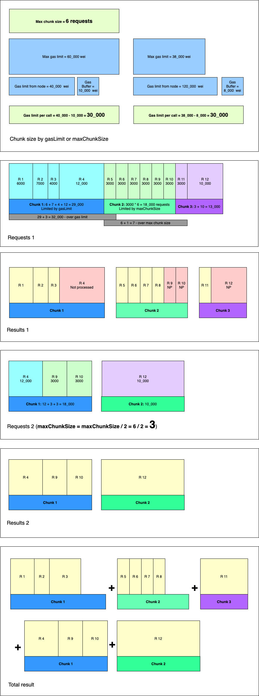

<div align="center">
    
    
</div>
g
# Multicall

### This is the package for high-weight optimized calls to blockchain nodes


## Installation

### Node

```
npm install @1inch/multicall
```

### Yarn

```
yarn install @1inch/multicall
```

## Onchain addresses

-   Ethereum mainnet: `0x8d035edd8e09c3283463dade67cc0d49d6868063`
-   BSC mainnet: `0x804708de7af615085203fa2b18eae59c5738e2a9`
-   Polygon mainnet: `0x59a0A6d73e6a5224871f45E6d845ce1574063ADe`
-   Arbitrum One: `0x11DEE30E710B8d4a8630392781Cc3c0046365d4c`
-   Gnosis Chain: `0xE295aD71242373C37C5FdA7B57F26f9eA1088AFe`
-   Avalanche: `0xC4A8B7e29E3C8ec560cd4945c1cF3461a85a148d`

## Motivation
The **MultiCall** contract is designed to execute multiple view calls at one time.  
For example, you have a list of tokens, and you need to get balances for all the items on that list.  

Let's try to do it in the most obvious way:

```typescript
const provider = new Web3ProviderConnector(new Web3('...'));
const walletAddress = '0x1111111111111111111111111111111111111111';

const tokens = [
    '0x6b175474e89094c44da98b954eedeac495271d0f',
    '0xa0b86991c6218b36c1d19d4a2e9eb0ce3606eb48',
    '0xdac17f958d2ee523a2206206994597c13d831ec7'
];

const contractCalls = tokens.map((tokenAddress) => {
    const callData = provider.contractEncodeABI(
        ERC20ABI,
        tokenAddress,
        'balanceOf',
        [walletAddress]
    );

    return provider.ethCall(
        tokenAddress,
        callData
    );
});

const balances = await Promise.all(contractCalls);
```

The downside to this solution is that you make as many requests for a contract as you have tokens on the list.  
And if the list is large enough, you will create a significant load on the provider.

### Simple MultiCall

A **multiCallService.callByChunks()** contract takes a list of requests, splits them into chunks and calls the provider in batches.

#### Default params
- maxChunkSize: **100**
- retriesLimit: **3**
- blockNumber: **'latest'**

Example:
```typescript
const provider = new Web3ProviderConnector(new Web3('...'));
const walletAddress = '0x1111111111111111111111111111111111111111';
const contractAddress = '0x8d035edd8e09c3283463dade67cc0d49d6868063';
const multiCallService = new MultiCallService(provider, contractAddress);

const tokens = [
    '0x6b175474e89094c44da98b954eedeac495271d0f',
    '0xa0b86991c6218b36c1d19d4a2e9eb0ce3606eb48',
    '0xdac17f958d2ee523a2206206994597c13d831ec7'
];

// The parameters are optional, if not specified, the default will be used
const params: MultiCallParams = {
    chunkSize: 100,
    retriesLimit: 3,
    blockNumber: 'latest'
};

const callDatas = tokens.map((tokenAddress) => {
    return {
        to: tokenAddress,
        data: provider.contractEncodeABI(
            ERC20ABI,
            tokenAddress,
            'balanceOf',
            [walletAddress]
        )
    };
});

const balances = await multiCallService.callByChunks(callDatas, params);
```

Got better! Instead of making a separate request to the provider for each item, we group them into butches and make much fewer requests.

>Note:
> If the call to this method exceeds the gas limit, then the entire request will be reverted.

### MultiCall by gas limit
**Problem:**  
The point is that the node has a limit for gas per call of the contract.  
And it may happen that by making a simple MultiCall we will not meet this limit.  
If the gas limit on the node is large enough, we may face a time limit on the execution of the contract method.  

In total, **there are 2 restrictions on a node:**
- by gas
- by time

To avoid these limitations, there is a more advanced method:  
**multiCallService.callByGasLimit()**

#### Default params
- maxChunkSize: **500**
- retriesLimit: **3**
- blockNumber: **'latest'**
- gasBuffer: **3000000**
- maxGasLimit: **150000000**

Example:

```typescript
const contractAddress = '0x8d035edd8e09c3283463dade67cc0d49d6868063';
const provider = new Web3ProviderConnector(new Web3('...'));

const gasLimitService = new GasLimitService(provider, contractAddress);
const multiCallService = new MultiCallService(provider, contractAddress);

const balanceOfGasUsage = 30_000;

const tokens = [
    '0x6b175474e89094c44da98b954eedeac495271d0f',
    '0xa0b86991c6218b36c1d19d4a2e9eb0ce3606eb48',
    '0xdac17f958d2ee523a2206206994597c13d831ec7'
];

const requests: MultiCallRequest[] = tokens.map((tokenAddress) => {
    return {
        to: tokenAddress,
        data: provider.contractEncodeABI(
            ERC20ABI,
            tokenAddress,
            'balanceOf',
            [walletAddress]
        ),
        gas: balanceOfGasUsage
    };
});

const gasLimit: number = await gasLimitService.calculateGasLimit();

// The parameters are optional, if not specified, the default will be used
const params: MultiCallParams = {
    maxChunkSize: 500,
    retriesLimit: 3,
    blockNumber: 'latest',
    gasBuffer: 100_000
};

const response = await multiCallService.callByGasLimit(
    requests,
    gasLimit,
    params
);
```

The idea is that we request the gas limit from the node and split the requests into chunks regarding this limit.  
Accordingly, we must set the gas limit for each request.  

>It is noteworthy that if suddenly the request does not fit into the gas limit, the entire request will not be reverted, and the request will return the results of those calls that fit into the gas limit.

If the call to the contract all the same does not fit into the gas limit, then the callByGasLimit() will automatically re-request those elements that have not been fulfilled.

**You can see a more detailed description of the library's work in the diagrams below.**

### GasLimitService
This service is used to correctly calculate the gas limit for calling a MultiCall.  
The basic formula for calculating the limit is as follows:
```typescript
const gasLimitForMultiCall = Math.min(gasLimitFromNode, maxGasLimit) - gasBuffer;
```
Where:  
`gasLimitFromNode` - is the gas limit taken from the node  
`maxGasLimit` - limiter on top, in case the gas limit from the node is too large (may cause timeout)  
`gasBuffer` - is some safe buffer that allows you to avoid crossing the limit in case of unforeseen situations

Example:
```typescript
const gasLimitForMultiCall = (Math.min(12_000_000, 40_000_000)) - 100_000; // 11_990_000
```
We believe that the multicall call should fit into 11_990_000 gas.  

#### Default params:
- gasBuffer: **3000000**
- maxGasLimit: **150000000**

Params for `GasLimitService.calculateGasLimit()` are optional, if not specified, then gas limit will be requested from the node and the default params will be used.

Example:
```typescript
const contractAddress = '0x8d035edd8e09c3283463dade67cc0d49d6868063';
const provider = new Web3ProviderConnector(new Web3('...'));

const gasLimitService = new GasLimitService(provider, contractAddress);

const gasLimit: number = await gasLimitService.calculateGasLimit();
```

Alternatively, you can specify your own parameters:
```typescript
const contractAddress = '0x8d035edd8e09c3283463dade67cc0d49d6868063';
const provider = new Web3ProviderConnector(new Web3('...'));

const gasLimitService = new GasLimitService(provider, contractAddress);

// 190_000
const gasLimit: number = await gasLimitService.calculateGasLimit({
    gasLimit: 200_000,
    maxGasLimit: 200_000,
    gasBuffer: 10_000,
    
});
```

## [Contract code](https://etherscan.io/address/0x8d035edd8e09c3283463dade67cc0d49d6868063#code)

---

## Algorithm activity diagram


---

## Algorithm visualization

